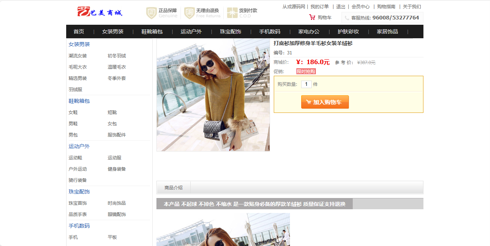
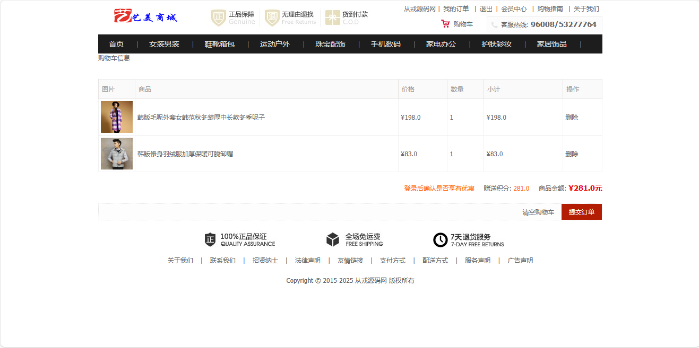
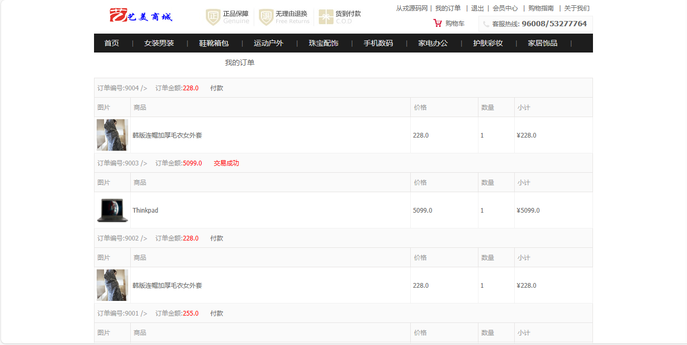
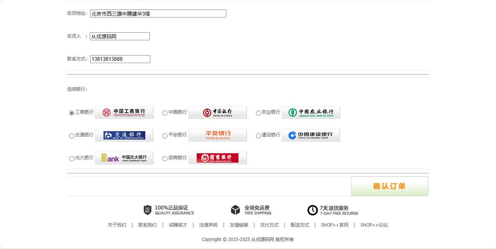
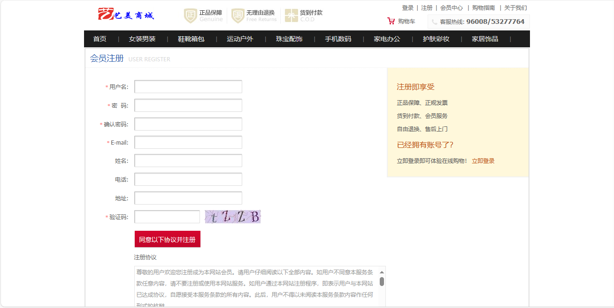

<h1 align="center">基于ssm的网上服饰珠宝手机数码购物商城管理系统</h1>

 获取sql文件 QQ: 386869957 QQ群: 377586148 

 [推荐站点: 从戎源码网](https://armycodes.com/) 

## 简介

> 本代码来源于网络,仅供学习参考使用!
> 
> 访问地址：http://localhost:8080/
> 用户名密码：congrong 123456
>

## 项目介绍
基于ssm的网上服饰珠宝手机数码购物商城管理系统：前端jsp、jquery，后端 spring、mybatis，集成商品浏览、商品详情、购物车、我的订单、分类展示商品等功能于一体的系统。

## 功能介绍

- 基本功能：登录、注册、退出
- 商品展示：热门商品展示、最新商品展示、左侧分类层级展示、导航栏主类目、商品详情、加入购物车
- 购物车：购物车列表、提交订单、购物车商品删除
- 我的订单：订单列表、订单再付款

## 环境

- <b>IntelliJ IDEA 2009.3</b>

- <b>Mysql 5.7.26</b>

- <b>Tomcat 7.0.73</b>

- <b>JDK 1.8</b>

## 运行截图

